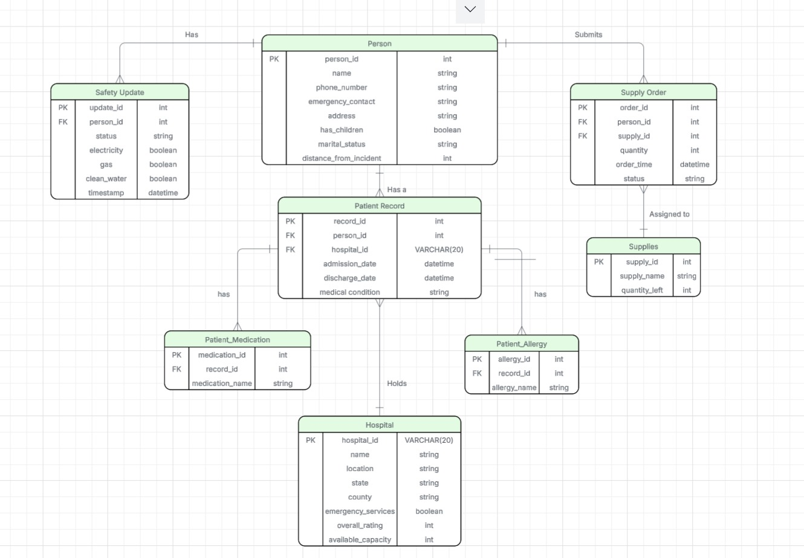

# Earthquake Emergency Database

## Project Overview

This project develops a relational database system designed to optimize emergency response and resource allocation after major earthquakes. By integrating isolated data from affected individuals, medical facilities, and supply distributors, the system enables relief organizations to quickly assess public safety, manage hospital bed capacity, and prioritize critical supply distribution.

---

## Project Timeline & Deliverables

### Week 1: Societal Problem Definition 
In major earthquake events, emergency logistics and medical dispatch are severely delayed due to fragmented data silos across organizations. This database addresses this critical challenge by unifying shelter, medical, and logistics management into a single relational structure.
- **Document**: `./docs/Societal_problem_definition.pdf`

### Week 2: Data Modeling (ERD) 
The conceptual and logical schema for our database design is documented in the `images/` and `docs/` directories:
- **ER Diagram**: 
  
- **Data Modeling Report**: `./docs/Data_modeling.pdf`

### Week 3: Schema Design & Database Connection in Code 
The database structure, table definitions, primary/foreign key constraints, and sample analytical queries are located in the `sql/` directory:
- **Schema Definition**: `./sql/schema.sql`
- **Initial Data**: `./sql/data.sql`
- **Sample Queries**: `./sql/queries.sql`

### Week 4: Video presentation of product to customers
We presented our database capabilities and stakeholder value proposition in our video demonstration:
- **Video Link**: [Watch the Presentation Video](./videos/presentation_video.mp4)

### Week 5: Integration of real data
To test how our database design holds up against real-world data, we integrated two complementary, open-licensed datasets (each containing over 50 unique rows).

#### 1. Datasets Used
* **Dataset 1: OpenFEMA Registration Intake and Individuals Household Program (RI-IHP) - v2**
  - **Source**: Federal Emergency Management Agency (FEMA) / U.S. Government
  - **URL**: [OpenFEMA Dataset Page](https://www.fema.gov/openfema-data-page/registration-intake-and-individuals-household-program-ri-ihp-v2)
  - **File Path**: `./data/RegistrationIntakeIndividualsHouseholdPrograms.csv`
  - **License**: U.S. Government Work / Open Data (Public Domain)
  - **Description**: Real-world data on disaster assistance registrations, locations (city, county, zip code), and financial support allocations used to populate and validate the FEMA_Registration table and support disaster-area analysis together with hospital data.

* **Dataset 2: CMS Hospital General Information**
  - **Source**: Centers for Medicare & Medicaid Services (CMS) / U.S. Department of Health & Human Services
  - **URL**: [Data.gov Hospital Dataset](https://data.cms.gov/provider-data/dataset/xubh-q36u)
  - **File Path**: `./data/Hospital_General_Information.csv`
  - **License**: Public Domain (U.S. Government Work)
  - **Description**: Comprehensive data on registered hospital facilities, locations, phone numbers, and emergency services used to validate the `Hospital` entity.

#### 2. Data Cleaning & Transformation
During integration, the datasets were cleaned and standardized using separate SQL cleaning scripts.

- **Hospital data**: Text values were trimmed, state codes were standardized to uppercase, empty values were converted to `NULL`, emergency-service values were converted to Boolean values, and unavailable hospital ratings were stored as `NULL`.
- **FEMA data**: State, city, and county names were standardized, and labels such as `Napa (County)` were cleaned to `NAPA`.
- **Person data**: Text fields were trimmed and missing marital status or emergency-contact values were handled consistently.
- **Duplicates**: Unique identifiers were checked for duplicates. No duplicate Hospital or FEMA IDs remained after import.

#### 3. Normalization & Schema Verification

After integrating the real-world Hospital and FEMA datasets, the database was checked again for normalization up to 3NF.

- **1NF**: All values remain atomic, with no multi-valued attributes.
- **2NF**: All tables use single-column primary keys, so no partial dependencies occur.
- **3NF**: No transitive dependencies were found that required further restructuring.

The `Hospital` table uses `hospital_id` as its primary key, and the `FEMA_Registration` table uses `fema_id`. Their remaining attributes describe the corresponding hospital or FEMA registration record.

Therefore, the database remains normalized up to **3NF** after real-world data integration.

- **Query Re-execution**: All four example queries were also re-run and returned meaningful results after cleaning and integration.

## Week 6: Final Analytical Queries & Data Release

### Analytical Queries & Societal Relevance
All queries can be found in `./sql/added_queries.sql`. Below are the team contributions:

#### Keira Nishigori (@Keira1203)
1. **Query 1: Top 10 Hospitals by Available Capacity**
   - **Question Answered:** Which hospitals currently have the highest available bed capacity?
   - **Societal Relevance:** Allows emergency dispatchers to route injured victims efficiently during an earthquake, preventing hospital overcrowding and saving lives.
2. **Query 2: Disaster-Affected Population Hotspots**
   - **Question Answered:** Which geographical areas have the highest number of affected individuals?
   - **Societal Relevance:** Helps relief organizations like FEMA prioritize the distribution of emergency supplies, water, and rescue teams to high-density affected zones.

### Zenodo Dataset Release
The full SQL database dump has been published on Zenodo:
- **Zenodo Repository:** https://zenodo.org/records/23211621


---

## Repository Structure

```text
.
├── README.md                                           # Project overview and full course deliverables
├── data/                                               # Real-world datasets (Week 5)
│   ├── Hospital_General_Information.csv               # CMS hospital dataset
│   └── RegistrationIntakeIndividualsHouseholdPrograms.csv # OpenFEMA assistance dataset
├── sql/                                                # Database SQL scripts
│   ├── schema.sql                                      # Schema definitions and constraints
│   ├── import.sql                                      # Imports real-world CSV datasets
│   ├── clean_hospital.sql                              # Cleans and validates hospital data
│   ├── clean_fema.sql                                  # Cleans and standardizes FEMA data
│   ├── clean_person.sql                                # Cleans mock person data
│   ├── data.sql                                        # Initial/mock data insertion
│   └── queries.sql                                     # Analytical and operational queries
├── images/                                             # Project diagrams (Week 2)
│   └── erd.png                                         # Entity Relationship Diagram
├── docs/                                               # Project documentation
│   ├── Societal_problem_definition.pdf                # Week 1 deliverable
│   └── Data_modeling.pdf                               # Week 2 deliverable
└── videos/                                             # Stakeholder video (Week 4)
    └── presentation_video.mp4                          # Video demonstration
```
## Team

- Alisa Januška
- Iyem Pelzer
- Keira Nishigori
- Nicole Mihailov


## HOW TO USE THE CODEBASE

### 1. Open MySQL

#### Windows

Open PowerShell and navigate to the MySQL `bin` folder:

```powershell
cd "C:\Program Files\MySQL\MySQL Server 8.0\bin"
```

Then log in:

```powershell
.\mysql -u root -p
```

#### macOS

Open Terminal and log in to MySQL:

```bash
mysql -u root -p
```

If the `mysql` command is not found, use the path to your MySQL installation or add MySQL to your PATH.

After successful login, you should see:

```text
mysql>
```

### 2. Create the database

**Run this only once.** You do not need to repeat it every time you use the codebase.

```sql
CREATE DATABASE disaster_management;
```

### 3. Select the database

```sql
USE disaster_management;
```

### 4. Create the database schema

Run the `schema.sql` file:

```sql
SOURCE <path-to-schema.sql>;
```

For example:

```sql
SOURCE C:/Users/Alisa/Desktop/disaster_management/schema.sql;
```

On macOS, use the path to the file on your Mac, for example:

```sql
SOURCE /Users/yourname/Desktop/disaster_management/schema.sql;
```
### 5. Import the base datasets

Run import.sql to load the CMS hospital dataset into Hospital and the FEMA dataset into FEMA_Registration.
```
SOURCE sql/import.sql;
```

### Verify Data Import  
You can verify that the data was imported successfully by running:

```
SELECT COUNT(*) FROM Hospital; -- Expected: 5,419 rows
SELECT COUNT(*) FROM FEMA_Registration; -- Expected 225,351 rows

```

### Run Order

Run the SQL scripts in the following order:

1. `schema.sql`
2. `import.sql`
3. `clean_hospital.sql`
4. `clean_fema.sql`
5. `data.sql`
6. `clean_person.sql`
7. `queries.sql`

### Important

* Steps **1** are done in **PowerShell/Terminal**.
* Steps **2–4** are done inside **MySQL**, after you see `mysql>`.
* `CREATE DATABASE disaster_management;` only needs to be run **once**.
* If the database already exists, do **not** run `CREATE DATABASE` again. Start with:

```sql
USE disaster_management;
```
* Make sure you launch MySQL with `--local-infile=1` so `import.sql` can read local CSV files properly
